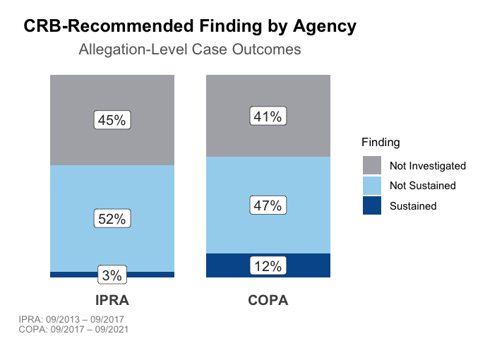
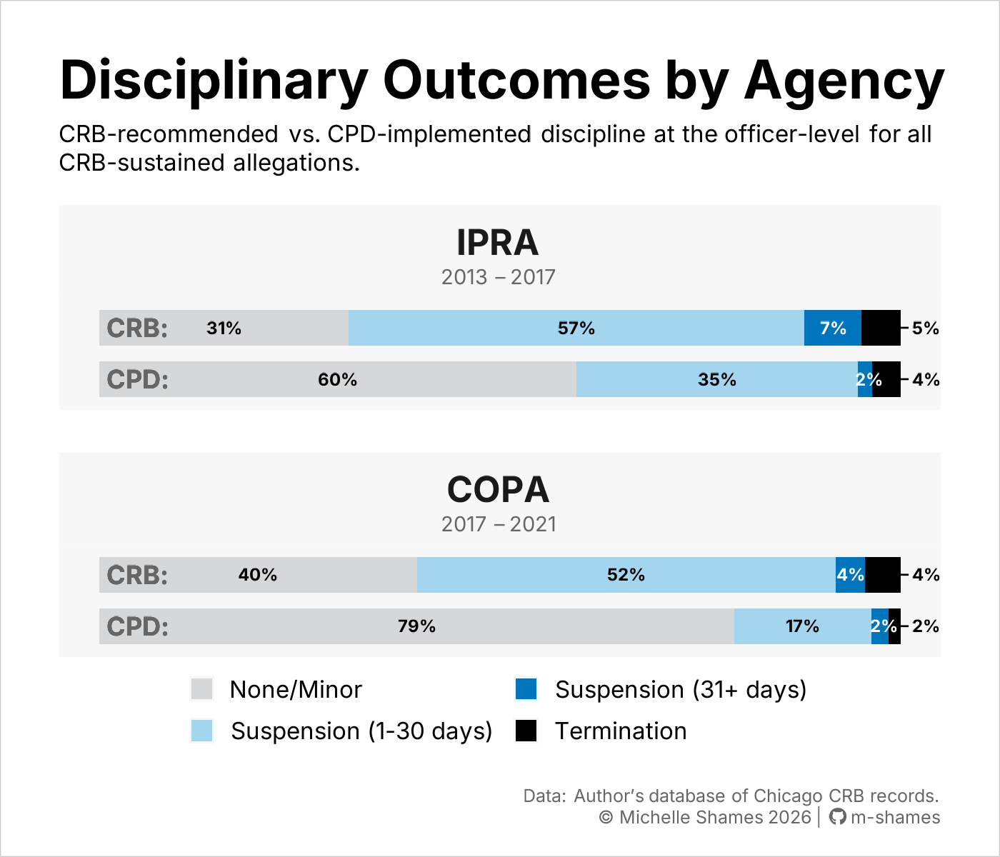
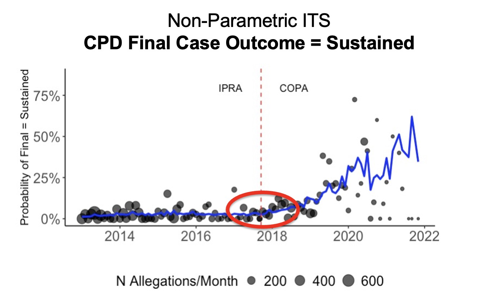
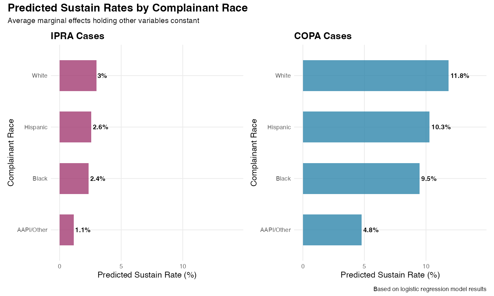

# Police Oversight & Accountability Research

Dissertation research evaluating the impact of Chicago's 2017 civilian oversight 
reforms on police misconduct investigation outcomes and officer discipline. Using 
an interrupted time series (ITS) design, this project asks whether the transition 
from the Independent Police Review Authority (IPRA) to the Civilian Office of 
Police Accountability (COPA) causally changed how complaints are investigated, 
substantiated, and acted upon.

[View code & data ↓](#data--code) | [View findings ↓](#findings)

----

## Key Findings

- Causal evidence that **CRB allegation substantiation rates increased** for civilian complaints reviewed post-reform (statistically significant).
- Statistical evidence that **racial disparities in substantiation rates persisted post-reform** (statistically significant).
- **No causal evidence that the 2017 reforms impacted** ***final*** **case or disciplinary outcomes** implemented by the Chicago Police Department.

----

## Project Overview

### Background
In 2017, Chicago implemented a series of reforms aimed at strengthening independent 
oversight and civilian review of the Chicago Police Department (CPD). The 
reforms centered on the creation of COPA, a new Civilian Review Board (CRB),
which replaced IPRA on Sept 15, 2017 with greater resources, jurisdiction, and 
independence from the CPD. While evidence indicates that complaints are being 
sustained at higher rates since COPA's launch, no prior empirical research 
has established whether this increase can be causally attributed to the reforms themselves.

### Research Questions
1. Did Chicago's civilian oversight reforms causally impact complaint substantiation 
rates, disciplinary recommendations, and CPD implementation of CRB recommendations?
2. Did the reforms reduce racial disparities in police misconduct investigation outcomes?

**Methodological contribution:** This project also evaluates Predictive Modeling 
Generated Counterfactual Outcomes (PMGCO), a machine learning approach for generating 
synthetic controls in policy evaluations where traditional designs (DiD, RDD) are 
unsuitable due to universal compliance and the absence of a control group.

### Data Sources
A comprehensive database of misconduct complaints and investigation outcomes was built from:

- FOIA-obtained data with final investigation outcomes and officer discipline
- Public complaint data spanning IPRA and COPA (available on the [Chicago Data Portal](https://data.cityofchicago.org/Public-Safety/COPA-Cases-Summary/mft5-nfa8/about_data))
- Demographic data from the American Community Survey  
- Shapefiles and jurisdiction boundaries from the City of Chicago and `tidycensus`  

### Sample
- **Time period:** Sept 15, 2013 – Sept 15, 2021 (±4 years around intervention)
- **Case Status:** Investigation was complete by the date FOIA data was obtained (June 2022) 
- **Complaint type:** Civilian complainants only  
- **Location:** Alleged incident within CPD jurisdiction, excluding O'Hare Airport
- **Final sample:** 25,288 unique police misconduct allegations

### Outcome Variables
- CRB recommended case finding
- CRB recommended officer discipline
- Final case finding adopted by CPD
- Final discipline implemented by CPD

The distribution of CRB recommended case findings by agency is shown in Figure 1.
*(Code for this figure is available [here](https://github.com/m-shames/portfolio/blob/updated/police-oversight/visualizations/fig1_code.R).)*  

  <figure id="fig1">
    
     
    <figcaption><strong>Figure 1:</strong> Distribution of Recommended Case Outcomes by Agency</figcaption>
  </figure>

 

### Research Design
- Logistic Regression
- Non-parametric Interrupted Time Series (ITS)  
- Predictive Modeling Generated Counterfactual Outcomes (PMGCO)

*Code and results for these analyses are available upon request.*

----

## Findings

**1. Impact on CRB Recommendations:** Strong causal evidence that the 2017 reforms 
led to an increase in the rate at which the CRB recommended sustaining complaints 
(see Figure 2).

  <figure id="fig2">
    
     
    <figcaption><strong>Figure 2:</strong> Predicted Probability of CRB's Recommended Outcome = Sustain</figcaption>
  </figure>

 

**2. Limited Impact on Final Outcomes:** No causal evidence that the reforms led to 
an increase in final sustain rates, suggesting the 2017 CRB reforms did not impact 
CPD leadership's adoption of CRB recommendations (see Figure 3).

  <figure id="fig3">
    
     
    <figcaption><strong>Figure 3:</strong> Predicted Probability of Final Outcome = Sustain</figcaption>
  </figure>

 

**3. Persistent Racial Disparities:** Racial disparities in complaint substantiation 
rates persisted in both recommended and final case outcomes despite the reforms 
(see Figure 4).

  <figure id="fig4">
    
     
    <figcaption><strong>Figure 4:</strong> Racial Disparities in CRB Recommended Sustain Rates</figcaption>
  </figure>

 

----

## Data & Code

### Available in this repository

**[`data-pipeline/`](https://github.com/m-shames/portfolio/tree/updated/police-oversight/data-pipeline)**: ETL pipeline for constructing the misconduct complaint database  

**`data-privacy/`**: Officer de-identification & anonymization *(forthcoming)*  

**[`data/`](https://github.com/m-shames/portfolio/tree/updated/police-oversight/data)**: Raw and processed data *(excluded via `.gitignore`; final dataset forthcoming post-defense)*

**`docs/`**: Codebook for the misconduct complaint database *(forthcoming)*  

**[`visualizations/`](https://github.com/m-shames/portfolio/tree/updated/police-oversight/visualizations)**  
- [`fig_helper.R`](https://github.com/m-shames/portfolio/blob/updated/police-oversight/visualizations/fig_helper.R): Helper functions for standardized figure specs
- [`fig1_code.R`](https://github.com/m-shames/portfolio/blob/updated/police-oversight/visualizations/fig1_code.R): Code for Figure 1

**Other**
- [`COPA_API.py`](https://github.com/m-shames/portfolio/blob/main/projects/police-oversight/1_code-sample/sample_API/COPA_API.py): Python API script for downloading public COPA complaint data from the Chicago Data Portal

### Available upon request
- Complete modeling and analysis code (logistic regression, ITS, PMGCO)
- Detailed results and robustness checks
- Sample complaint database

----

## Publication Status

Manuscripts are currently in preparation for peer-reviewed publication.

> This repository reflects research in progress and may not represent final findings. 
> The complaint database and more complete findings will be shared publicly upon 
> project completion.
