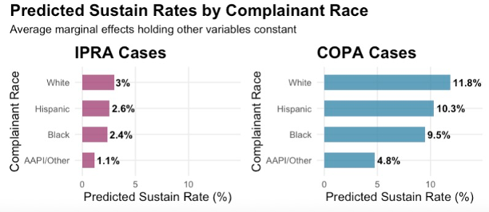

# Police Oversight Research  
As part of my dissertation research, this project evaluates the impact of Chicago Civilian Review Board (CRB) reforms implemented in 2017 on misconduct investigation outcomes and police officer discipline. 

### Key Findings

- Causal evidence that **CRB allegation substantiation rates increased** for civilian complaints reviewed post-reform (statistically significant).    
- Statistical evidence that **racial disparities in substantiation rates persisted post-reforms** (statistically significant).   
- **No causal evidence that the 2017 reforms impacted** ***final*** **case or disciplinary outcomes** implemented by the Chicago Police Department.  

[View detailed project overview below ↓](#project-overview)

---- 

# Data & Code

### Available in this repository: 

**ETL pipeline for building complaint database**

  - [`1_bigquery_copa_extract.R`](https://github.com/m-shames/portfolio/blob/main/projects/police-oversight/1_code-sample/sample_v1/1_bigquery_copa_extract.R):
  Extract FOIA data from BigQuery cloud data warehouse
  - [`2_copa_ETL.R`](https://github.com/m-shames/portfolio/blob/main/projects/police-oversight/1_code-sample/sample_v1/2_copa_ETL.R):
Prep and merge FOIA and ACS datasets

**API scripts for public data download**

  - [`COPA_API.py`](https://github.com/m-shames/portfolio/blob/main/projects/police-oversight/1_code-sample/sample_API/COPA_API.py):
Python API script for downloading public COPA complaint data  

**Visualizations**  

  - [`Code_fig1-crb-finding.R`](https://github.com/m-shames/portfolio/blob/main/projects/police-oversight/2_visualizations/Code_fig1-crb-finding.R): Code for [Figure 1](#fig1).  

### Available upon request: 

- Complete modeling and analyses code (logistic regression, interrupted time series, machine learning)
- Detailed results and robustness checks
- Sample complaint database

---- 

# Project Overview

## Background 
In 2017, Chicago implemented a series of reforms aimed at strengthening civilian 
review and independent oversight of the Chicago Police Department (CPD). 
The reforms centered around the launch of the Civilian Office of Police Accountability 
(COPA), which replaced Chicago's former CRB agency (Independent Police Review Authority/IPRA). Both agencies investigated 
allegations of CPD misconduct, but COPA received greater resources, jurisdiction, 
and independence from the CPD than its predecessor agency. While evidence 
indicates that complaints are being sustained at higher rates since COPA's launch, 
no empirical research has established whether this increase can be causally attributed to the 
reforms themselves.

## Research Questions
This project answers two primary questions:  

1. Did Chicago's civilian oversight reforms causally impact complaint substantiation rates, 
disciplinary recommendations, and CPD implementation of CRB recommendations?    
2. Did the reforms reduce racial disparities in police misconduct investigation outcomes?    

**Methodological contribution:** 
Parts of this project also explore whether Predictive Modeling Generated Counterfactual Outcomes (PMGCO),
a novel machine learning approach I am developing for generating synthetic controls, is more suitable 
for causal inference than traditional designs (DiD, RDD) in policy evaluations with universal compliance and no control group.

## Data Sources
I built a comprehensive database of civilian complaint investigation outcomes using:  

- Public complaint data spanning IPRA and COPA ([retrieved here](https://data.cityofchicago.org/Public-Safety/COPA-Cases-Summary/mft5-nfa8/about_data))
- FOIA-obtained data with final investigation outcomes and officer discipline
- Demographic data from the American Community Survey    

View ETL pipeline code [here](https://github.com/m-shames/portfolio/blob/main/projects/police-oversight/1_code-sample/sample_v1/2_copa_ETL.R). 

## Sample  
The complaint sample was limited to:   

- **Time period:** 2013-2021 (last 4 years of IPRA & first 4 years of COPA)  
- **Complainant:** Filed by a civilian (not another CPD officer)    
- **Location:** Alleged misconduct occurred within CPD jurisdiction, excluding O'Hare Airport   

**Final Sample:** 26,525 unique police misconduct allegations

## Outcome Variables
The outcomes of interest for this project were:  

- CRB's recommended case finding  
- CRB's recommended officer discipline  
- Final case finding adopted by CPD  
- Final discipline implemented by CPD  

The distribution of CRB's recommended case findings by agency are plotted in [Figure 1](#fig1).
(Code for this figure is available [here](https://github.com/m-shames/portfolio/blob/main/projects/police-oversight/2_visualizations/Code_fig1-crb-finding.R)).  

  <figure id="fig1">
    
     
    <figcaption><strong>Figure 1:</strong> Distribution of Recommended Case Outcomes by Agency</figcaption>
  </figure>

 

## Research Design
Multiple analyses have been conducted to answer various aspects of the research questions. These include:  

- Logistic Regression      
- Non-parametric Interrupted Time Series  
- Predictive Modeling Generated Counterfactual Outcomes (PMGCO)  

*Code and results for these analyses are available upon request.*  

## Findings  
Preliminary key findings include: 

1. **Impact on CRB Recommendations:** Strong causal evidence that the 2017 reforms led to an
increase in the rate at which the CRB recommended sustaining complaints (see [Figure 2](#fig2)).

  <figure id="fig2">
    
     
    <figcaption><strong>Figure 2:</strong> Predicted Probability of CRB's Recommended Outcome = Sustain</figcaption>
  </figure>

 

2. **Limited Impact on Final Outcomes:** No causal evidence that the reforms led to an increase in
final sustain rates. This suggests that the 2017 CRB reforms did not impact CPD leadership's adoption 
of CRB recommendations (see [Figure 3](#fig3)).

  <figure id="fig3">
    
     
    <figcaption><strong>Figure 3:</strong> Predicted Probability of Final Outcome = Sustain</figcaption>
  </figure>

 

3. **Persistent Racial Disparities:** Racial disparities in complaint substantiation rates persisted in both 
recommended and final case outcomes, despite the CRB reform efforts to reduce disparities (see [Figure 4](#fig4)).     

  <figure id="fig4">
    
     
    <figcaption><strong>Figure 4:</strong> Racial Disparities in CRB Recommended Sustain Rates</figcaption>
  </figure>

 

## Publication Status

A manuscript is currently in preparation for peer-reviewed publication.

*Additional findings, detailed analyses, and policy implications available upon request.*

----

***Disclaimer:*** *This research is ongoing and this repository may not represent current findings. Upon project completion, I plan to publicly share the complaint database and more detailed research findings.*  
